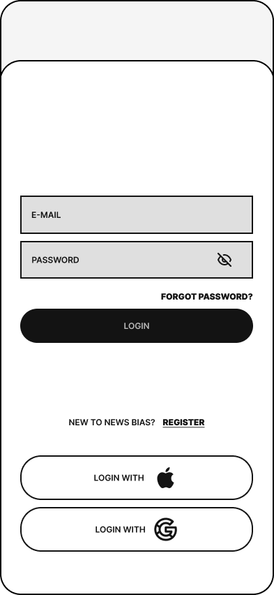
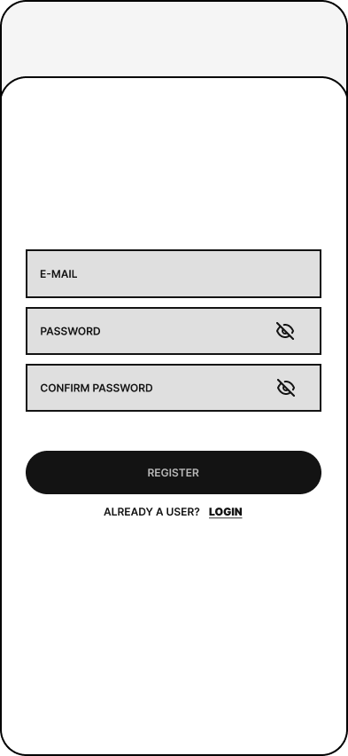

# User Experience Design

## Prototype

Here's a [link to the figma prototype](https://www.figma.com/proto/9ccuAY5ePBVdcPFLYqk3gj/Newspaper-Bias-App---Unincited?node-id=4056-205&t=7QILj4g8hiheERIB-1&scaling=scale-down&content-scaling=fixed&page-id=4002%3A155&starting-point-node-id=4056%3A205).

Our prototype uses mock device (iPhone 15 Pro). It also utilized figma components and variants. 

As required in the [instructions](instructions-0b-prototyping.md), all buttons, links or other user interface components that allow a user to transition from one screen to another is functional in our prototype; User interface components that show a dynamic overlay panel when clicked or tapped is functional in our prototype; It is designed to clearly show the way in which a user navigates from one screen to another, as well as how they solve the core use cases and needs your app is designed to solve.

## App Map

## Wireframes

### Internal Wireframe Design Conventions

To ensure clarity and consistency across our prototypes, please note the following visual language and interaction rules established by the team:

- Rounded corners indicate interactive, clickable components (e.g., buttons), whereas sharp, square corners are reserved strictly for static, non-interactive elements
  - However, a shaded square corner hints a text input field. 
- Overall visual hierarchy is primarily established through variations in font size and weight (boldness).
  - Opacity adjustments applied only in specialized cases where hierarchy is complex.
  - Small text is rendered in uppercase to enhance visual clarity and communication. 
- The color black is used purposefully to denote active states (such as selected filters) or to highlight critical operations related to database modifications.
- Following internal team discussions, a lightweight design language has been partially integrated into the wireframes
  - Components within the article view (specifically sliders, chips, and text highlights) reflect our design direction.
  - The visual styling for other components, most notably the statistical charts, remains raw.

### Login

Accepts email and password to log in. Features a "Login" button routing to the Dashboard and a link to the Register screen. Login with google and apple is also considered in our user stories.

 

### Register

Captures name, email, and password. The "Create Account" button navigates to the Dashboard. Includes a login link for existing users.

 

### Home

Features a scrollable list of article cards showing key details (image, source, headline, badges). Tapping a card opens the Article Detail view.

 

### Article Detail

Displays full text alongside visual bias and sentiment meters. Includes source, author, date, "add to saved" star icon, and a back button to return to the previous screen.  Highlighted text indicates biased writing.

 

### Statistics

Contains data visualizations such as a bias distribution bar chart, a sentiment trend line graph, and a quick stats grid.  Users can also select the statistic time range from the upper right dropdown menu.

 

### My Articles

Uses tab navigation to switch between "Submitted" and "Saved" lists. Includes a "+ Submit" button for new analysis requests.

 

### Submit Article

Contains fields for the URL and an optional title. The "Analyze Article" button triggers a submitted success state.

 

### About

Divided into sections explaining the app's purpose and how it works.

 